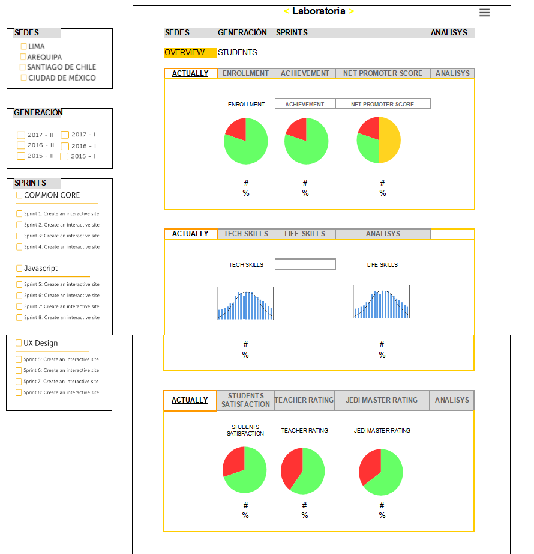

# Reto 3. Crea un sketch para la herramienta del dashboard de Laboratoria
El dashboard es una herramienta utilizada por profesores, training managers, directores y gerentes de Laboratoria para ver rápidamente qué está pasando en el salón de clases de Laboratoria. En el dashboard, los usuarios mencionados pueden ver rápidamente estadísticas y datos en tiempo real como:

- Nro de alumnas inscritas
- Nro de alumnas que desertaron
- Nro de % de alumnas que pasan el criterio mínimo de evaluación
- Promedio de notas por sprint
- Promedio de notas HSE
- Promedio de notas técnicas
- Además, dado que Laboratoria tiene muchas generaciones, regularmente 2 generaciones por año (estas generaciones empezaron en el 2014), y que opera en 4 sedes (Arequipa, Ciudad de México, Lima y Santiago de Chile), es posible que  los usuarios quieran ver datos de sedes / generaciones anteriores para poder hacer comparaciones.

Ademas ...
- Recuerda que este sketch es parte del producto final de esta unidad.
- Haz un sketch del dashboard de Laboratoria.
- Ten en cuenta los elementos de navegación en tus sketches.
- Utiliza títulos y textos reales.

